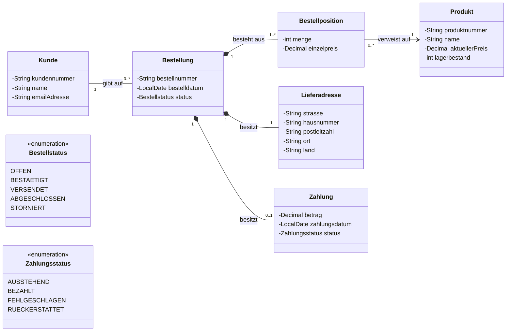

# Szenario 2: Online-Shop

## UML-Klassendiagramm

`-` kennzeichnet private Attribute. Die beiden Statuswerte werden als
Aufzählungstypen modelliert, damit nur gültige Zustände gespeichert werden
können. Sie sind ergänzende Details; die sechs fachlichen Klassen stammen
direkt aus der Aufgabenbeschreibung.

## Beziehungen und Multiplizitäten

| Beziehung | Art | Begründung |
|---|---|---|
| Kunde – Bestellung | Assoziation `1` zu `0..*` | Ein Kunde kann keine, eine oder viele Bestellungen aufgeben. Jede Bestellung gehört genau einem Kunden. Eine Löschweitergabe wird nicht verlangt. |
| Bestellung – Bestellposition | Komposition `1` zu `1..*` | Jede Bestellung enthält mindestens eine Position. Eine Position kann ohne ihre Bestellung nicht existieren und wird mit ihr gelöscht. |
| Bestellung – Lieferadresse | Komposition `1` zu `1` | Die Adresse wird als fester Bestandteil der Bestellung gespeichert und zusammen mit dieser gelöscht. |
| Bestellung – Zahlung | Komposition `1` zu `0..1` | Eine neue Bestellung kann noch ohne Zahlung bestehen und später höchstens eine Zahlung besitzen. Die Zahlung kann nicht unabhängig existieren. |
| Bestellposition – Produkt | gerichtete Assoziation `0..*` zu `1` | Jede Position verweist auf genau ein Produkt. Ein Produkt kann in beliebig vielen oder noch in keiner Position vorkommen und bleibt beim Löschen einer Bestellung erhalten. |

Eine **Aggregation** wird absichtlich nicht verwendet. Die Beschreibung nennt
zwischen Kunde, Bestellung und Produkt keine schwache Teil-Ganzes-Beziehung.
Die Lebenszyklusabhängigkeiten sind dagegen eindeutig Kompositionen. Eine
Aggregation nur einzubauen, damit jedes Beziehungssymbol vorkommt, wäre
fachlich falsch.

Der ausgefüllte Diamant steht jeweils auf der Seite des Ganzen, also bei
`Bestellung`.

## Antworten auf die Theoriefragen

### Müssen Getter und Setter im Diagramm abgebildet werden?

Nein. Getter und Setter müssen nur gezeigt werden, wenn die technische
Schnittstelle einer Klasse wichtig ist. In einem fachlichen Klassendiagramm
reichen normalerweise die Attribute und fachlich relevante Methoden. Alle
Getter und Setter würden das Diagramm hier unnötig überladen.

### Gehört die Klasse mit der `main`-Methode zum Diagramm?

Nicht in dieses fachliche Klassendiagramm. Eine Start- oder Anwendungsklasse
gehört nur dazu, wenn die technische Programmstruktur dargestellt werden soll.
Sie ist keine Klasse des beschriebenen Geschäftsmodells.

### Wann ist eine bidirektionale Beziehung sinnvoll?

Wenn beide Objekte im Programm direkt aufeinander zugreifen müssen. Eine
Bestellung könnte beispielsweise ihren Kunden kennen und ein Kunde seine
Bestellungen. Bidirektionale Beziehungen erzeugen aber zusätzlichen Aufwand,
weil beide Seiten konsistent gehalten werden müssen. Deshalb sollte man sie nur
einsetzen, wenn beide Navigationsrichtungen tatsächlich gebraucht werden.

### Reicht eine Assoziation ohne Pfeil?

Ja. Eine Linie ohne Pfeil ist eine gültige Assoziation. Sie lässt die
Navigierbarkeit offen oder wird oft als beidseitig lesbar verstanden. Wenn nur
eine Navigationsrichtung wichtig ist, kann sie mit einer Pfeilspitze präzisiert
werden. Im Diagramm ist deshalb nur die Referenz von `Bestellposition` auf
`Produkt` gerichtet dargestellt.

## Annahmen

- Nummern sowie Haus- und Postleitzahlen sind `String`, da sie führende Nullen
  oder Buchstaben enthalten können.
- Geldbeträge werden als `Decimal` und nicht als Gleitkommazahl modelliert.
- Der gespeicherte Einzelpreis einer Bestellposition bleibt unverändert, auch
  wenn sich der aktuelle Produktpreis später ändert.
