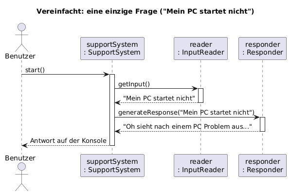
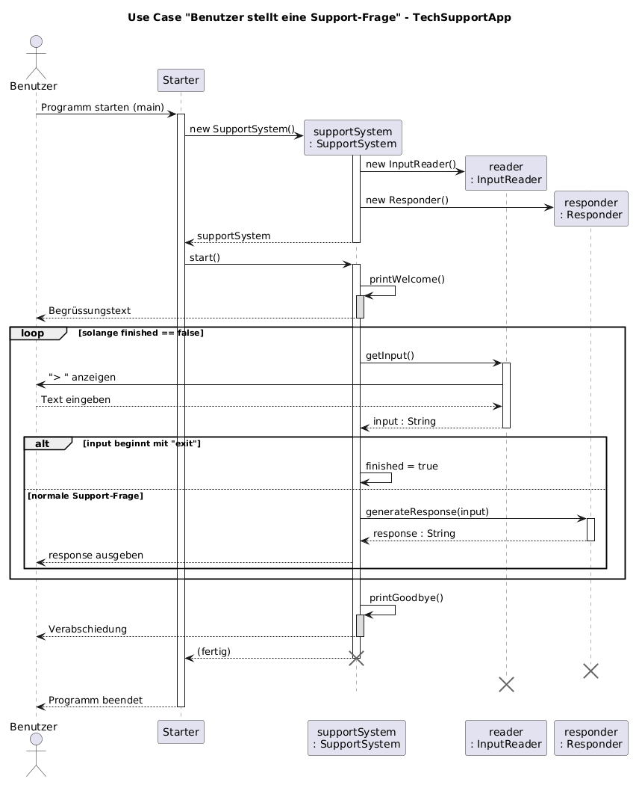

# KN-M2 – Sequenzdiagramm (Modul 320)

| | |
|---|---|
| **Kompetenznachweis** | KN-M2 – Interaktion zwischen Objekten grafisch darstellen |
| **Autor** | Nico Schult (GitHub: ZH-NICO) |
| **Modul** | M320 – Objektorientiert programmieren |
| **Tool** | PlantUML |
| **Datum** | 17.08.2026 |

Original-Auftrag: <https://gitlab.com/ch-tbz-it/Stud/m320/-/tree/main/Kompetenzen/KN-M2>

---

## 1. Was war der Auftrag?

Kurz gesagt: **Einen Use Case aus echtem Code als UML-Sequenzdiagramm zeichnen.**

Der Auftrag erlaubt zwei Varianten:

1. Eigenen Code verwenden.
2. **Fremden Code** nehmen, zuerst zum Laufen bringen und dann einen Use Case zeichnen.

Ich habe **Variante 2** gemacht, mit der vorgegebenen **Tech-Support App**:
<https://gitlab.com/JulianKaser/javaressources/-/tree/main/code/TechSupportApp>

---

## 2. Was habe ich gemacht? (Kurzfassung)

1. Fremden Code heruntergeladen und **zum Laufen gebracht** (kompiliert + getestet, siehe Kapitel 3).
2. Den Code gelesen und einen **Use Case** ausgewählt: *"Benutzer stellt eine Support-Frage"*.
3. Diesen Use Case als **Sequenzdiagramm in PlantUML** gezeichnet (Kapitel 5).
4. Alles erklärt: Symbole, statisch vs. dynamisch, und die Fragen zur Besprechung beantwortet (Kapitel 7–9).

---

## 3. Der fremde Code – zum Laufen gebracht

Der Code liegt im Ordner [`code/`](code/) und besteht aus 4 Klassen:

| Klasse | Aufgabe (einfach erklärt) |
|---|---|
| `Starter` | Startet das Programm (`main`-Methode). Erzeugt ein `SupportSystem` und ruft `start()` auf. |
| `SupportSystem` | Der **Chef**. Steuert den Ablauf: begrüssen → Frage lesen → Antwort holen → ausgeben → wiederholen → verabschieden. |
| `InputReader` | Liest die Eingabe des Benutzers von der Tastatur (`Scanner`). |
| `Responder` | Sucht im Text nach Stichwörtern (z. B. "PC", "Drucker") und gibt die passende Antwort zurück. |

### So wird es gestartet

```bash
cd code
javac -encoding UTF-8 *.java
java Starter
```

### Testlauf (hat funktioniert)

Eingaben: `Mein PC startet nicht`, `Drucker kaputt`, `exit`

```text
Willkommen zum IT Support

Bitte lassen sie uns wissen was ihr Problem ist
Wir werden ihnen versuchen so gut wie es geht zu helfen
Bitte schreiben sie 'exit' um den IT SUpport zu beenden
> Mein PC startet nicht
Oh sieht nach einem PC Problem aus...
> Drucker kaputt
Haben sie dem Drucker alles gegeben was er braucht?
> exit
Ich hoffe ich konnte helfen :) Tschüss...
```

Getestet mit Java 25. Der Code wurde **nicht verändert** (es ist fremder Code), damit das Diagramm
genau zu diesem Code passt.

> **Beobachtung (kleiner Fehler im fremden Code):**
> In `Responder.generateResponse()` steht `if (input.contains(""))`. Ein leerer Text ist in *jedem*
> String enthalten, darum ist diese Bedingung **immer wahr**. Alle Stichwörter darunter
> ("bug", "internet", "Bildschirm", …) werden deshalb **nie** erreicht.
> Für das Sequenzdiagramm ändert das nichts: `generateResponse()` gibt immer *einen* String zurück.

---

## 4. Der gewählte Use Case

**Use Case: "Benutzer stellt eine Support-Frage"**

| | |
|---|---|
| **Akteur** | Benutzer (Person mit einem IT-Problem) |
| **Ziel** | Der Benutzer schreibt sein Problem und bekommt eine Antwort vom Support |
| **Auslöser** | Der Benutzer startet das Programm |
| **Normaler Ablauf** | Programm begrüsst → Benutzer tippt Frage → Programm antwortet → nächste Frage möglich |
| **Alternativer Ablauf** | Benutzer tippt `exit` → Programm verabschiedet sich und endet |

**Warum dieser Use Case?** Er zeigt, wie **alle vier Objekte zusammenarbeiten**, und er enthält eine
Schleife (mehrere Fragen) und eine Verzweigung (`exit` oder normale Frage). Genau das kann man in
einem Sequenzdiagramm gut zeigen.

---

## 5. Das Sequenzdiagramm

### 5.1 Zuerst einfach: eine einzige Frage

Damit man den Weg einer **einzelnen** Frage sofort sieht (ohne Schleife, ohne Verzweigung):



Lesen von oben nach unten: `SupportSystem` fragt `InputReader` nach dem Text, gibt den Text an
`Responder`, bekommt die Antwort zurück und schreibt sie auf die Konsole.

PlantUML-Code: [`diagramm/sequenzdiagramm-einfach.puml`](diagramm/sequenzdiagramm-einfach.puml)

### 5.2 Das komplette Diagramm zum Use Case



PlantUML-Code: [`diagramm/sequenzdiagramm.puml`](diagramm/sequenzdiagramm.puml)
(auch als [SVG](diagramm/sequenzdiagramm.svg) vorhanden – gut zum Zoomen)

---

## 6. Der Ablauf in Worten (passt Schritt für Schritt zum Diagramm)

1. Der **Benutzer** startet das Programm → `Starter.main()` läuft.
2. `Starter` erzeugt das Objekt `supportSystem` → **`new SupportSystem()`**.
3. Im Konstruktor erzeugt `SupportSystem` seine zwei Helfer: **`new InputReader()`** und **`new Responder()`**.
   → Ab hier gibt es 4 Objekte.
4. `Starter` ruft **`start()`** auf. Jetzt beginnt der eigentliche Use Case.
5. `SupportSystem` ruft sich **selbst** auf: `printWelcome()` → Begrüssung auf der Konsole.
6. Jetzt beginnt die **Schleife** (`while(!finished)`), sie wiederholt sich für jede Frage:
   1. `SupportSystem` ruft `reader.getInput()` auf.
   2. `InputReader` zeigt `> ` an und wartet, bis der Benutzer etwas tippt.
   3. `InputReader` gibt den Text **zurück** (Return-Value `input : String`).
   4. **Verzweigung (`alt`)**:
      - Text beginnt mit `exit` → `finished = true`, die Schleife endet.
      - Sonst → `SupportSystem` ruft `responder.generateResponse(input)` auf, bekommt die
        Antwort **zurück** und gibt sie mit `System.out.println()` aus.
7. Nach der Schleife ruft `SupportSystem` sich selbst `printGoodbye()` auf → Verabschiedung.
8. `start()` ist fertig, die Kontrolle geht zurück an `Starter`. Das Programm endet, die Objekte
   werden nicht mehr gebraucht (im Diagramm die **X**-Symbole).

---

## 7. Die wichtigsten Symbole im Sequenzdiagramm

| Symbol im Bild | Name | Was es bedeutet | PlantUML |
|---|---|---|---|
| Rechteck oben | **Objekt / Teilnehmer** | Ein Objekt, das mitspielt. Schreibweise `name : Klasse`. | `participant "reader\n: InputReader" as reader` |
| Strichmännchen | **Aktor** | Ein Mensch (oder System) von aussen. | `actor "Benutzer" as user` |
| Gestrichelte senkrechte Linie | **Lebenslinie (Lifeline)** | Die Zeitachse des Objekts. **Zeit läuft nach unten.** | automatisch |
| Schmaler weisser Balken | **Aktivierungsbalken** | Das Objekt ist gerade aktiv (seine Methode läuft). | `activate` / `deactivate` |
| Pfeil mit durchgezogener Linie und gefüllter Spitze | **Nachricht / Methodenaufruf** | Objekt A ruft eine Methode von Objekt B auf. | `sys -> reader : getInput()` |
| Pfeil mit gestrichelter Linie | **Antwort / Return-Value** | Das Ergebnis kommt zurück. | `reader --> sys : input : String` |
| Pfeil, der zum gleichen Objekt zurückgeht | **Selbstaufruf** | Ein Objekt ruft seine eigene Methode auf. | `sys -> sys : printWelcome()` |
| Pfeil auf ein neues Rechteck weiter unten | **Objekterzeugung** | Hier wird das Objekt mit `new` erzeugt. | `create participant ...` |
| Grosses **X** am Ende der Linie | **Objektende (destroy)** | Ab hier existiert das Objekt nicht mehr. | `destroy reader` |
| Rahmen mit `loop` | **Schleife** | Der Teil wird wiederholt (hier: `while`). | `loop solange finished == false` |
| Rahmen mit `alt` | **Alternative** | Entweder / oder (hier: `if / else`). | `alt ... else ... end` |

---

## 8. Unterschied: statische und dynamische Darstellung

| | **Statisch** | **Dynamisch** |
|---|---|---|
| Typisches Diagramm | Klassendiagramm | **Sequenzdiagramm**, Aktivitätsdiagramm |
| Zeigt | **Aufbau**: welche Klassen es gibt, ihre Attribute/Methoden und ihre Beziehungen | **Ablauf**: wer ruft wen wann auf, in welcher Reihenfolge |
| Zeit | keine Zeit sichtbar | Zeit läuft **von oben nach unten** |
| Beispiel hier | `SupportSystem` *hat ein* `InputReader` und *hat ein* `Responder` | `SupportSystem` ruft zuerst `getInput()`, **danach** `generateResponse()` |

Merksatz: **statisch = Bauplan des Hauses, dynamisch = Film davon, wie die Leute darin herumlaufen.**

---

## 9. Antworten auf die Fragen zur Besprechung

**1. Wie werden Aufrufe von einem Objekt zu einem anderen dargestellt?**
Mit einem waagrechten Pfeil von der Lebenslinie des Aufrufers zur Lebenslinie des Empfängers.
Durchgezogene Linie + gefüllte Spitze = ein normaler (synchroner) Methodenaufruf. Auf den Pfeil
schreibt man den Methodennamen mit Parametern.
```plantuml
sys -> responder : generateResponse(input)
```

**2. Was sind Swimlanes?**
Swimlanes ("Schwimmbahnen") sind Spalten/Bahnen, in denen alles steht, was zu **einem** Beteiligten
gehört. Im Sequenzdiagramm ist die **senkrechte Bahn jedes Objekts** (Lebenslinie + Aktivierungsbalken)
so eine Bahn – man sieht sofort, bei welchem Objekt gerade etwas passiert. Der Begriff kommt aber
eigentlich vom **Aktivitätsdiagramm**, dort werden Swimlanes ausdrücklich als Bahnen gezeichnet
(z. B. eine Bahn pro Abteilung oder pro Rolle).

**3. Kann ich in einem Sequenzdiagramm sehen, wie lange ein Objekt "lebt"?**
Ja. Die Lebenslinie beginnt dort, wo das Objekt erzeugt wird (im Diagramm: das Rechteck von
`reader` und `responder` steht weiter unten, weil sie erst im Konstruktor mit `new` entstehen) und
endet beim **X**, wenn das Objekt nicht mehr gebraucht wird. Der Balken auf der Linie zeigt
zusätzlich, *wann das Objekt gerade aktiv ist* – "lebendig" und "aktiv" sind also zwei
verschiedene Dinge.

**4. Wie kann die Antwort (Return-Value) von einem Objekt dargestellt werden?**
Mit einem **gestrichelten** Pfeil zurück zum Aufrufer. Draufschreiben, was zurückkommt
(z. B. `input : String`).
```plantuml
reader --> sys : input : String
```

**5. Wie werden Aufrufe innerhalb desselben Objekts dargestellt?**
Als kleiner Pfeil, der von der Lebenslinie weggeht und **auf dieselbe Lebenslinie** zurückkommt
(Selbstaufruf). Oft entsteht dabei ein zweiter, verschachtelter Aktivierungsbalken.
```plantuml
sys -> sys : printWelcome()
```

**6. Wie kann ich eine alternative Sequenz im Diagramm zeigen?**
Mit einem `alt`-Fragment: ein Rahmen, der durch eine gestrichelte Linie in Bereiche geteilt ist.
Oben links steht `alt`, in eckigen Klammern die Bedingung.
```plantuml
alt input beginnt mit "exit"
    sys -> sys : finished = true
else normale Support-Frage
    sys -> responder : generateResponse(input)
end
```
Verwandte Rahmen: `loop` (Wiederholung), `opt` (optional, nur wenn Bedingung stimmt),
`par` (parallel).

---

## 10. Dateien in diesem Ordner

```text
KN-M2/
├── README.md                            <- diese Dokumentation
├── code/                                <- fremder Code (TechSupportApp), unverändert
│   ├── Starter.java
│   ├── SupportSystem.java
│   ├── InputReader.java
│   └── Responder.java
└── diagramm/
    ├── sequenzdiagramm.puml             <- PlantUML-Quelle (komplett)
    ├── sequenzdiagramm.png
    ├── sequenzdiagramm.svg
    ├── sequenzdiagramm-einfach.puml     <- PlantUML-Quelle (vereinfacht)
    ├── sequenzdiagramm-einfach.png
    └── sequenzdiagramm-einfach.svg
```

### Diagramm selber neu erzeugen

- **Am einfachsten:** Inhalt der `.puml`-Datei auf <https://www.plantuml.com/plantuml> einfügen.
- **In VS Code:** Extension "PlantUML" installieren, `.puml` öffnen, `Alt+D` für die Vorschau.
- **Lokal mit JAR:** `java -jar plantuml.jar -charset UTF-8 diagramm/sequenzdiagramm.puml`

---

## 11. Lernziele-Check

- [x] Ich kann für einen bestimmten Use Case die Interaktion zwischen den Objekten grafisch darstellen. → Kapitel 4 + 5
- [x] Ich kenne die wichtigsten Symbole eines UML-Sequenzdiagramms. → Kapitel 7
- [x] Ich kenne den Unterschied zwischen dynamischer und statischer Darstellung. → Kapitel 8
- [x] Ich kann ein Sequenzdiagramm mit einem passenden Tool umsetzen (PlantUML). → `diagramm/*.puml`

**Quellen:** Unterricht M320 · PlantUML-Doku <https://plantuml.com/sequence-diagram> ·
fremder Code von <https://gitlab.com/JulianKaser/javaressources>
