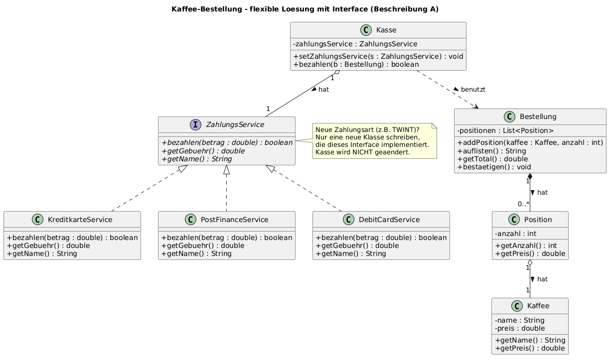
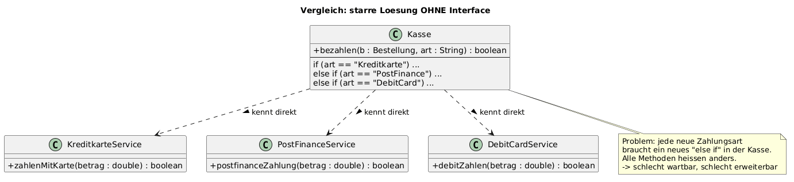

# KN-M3 – Klassendiagramm mit Interfaces (Modul 320)

Nico Schult (ZH-NICO) · Tool: PlantUML · 17.08.2026
Auftrag: <https://gitlab.com/ch-tbz-it/Stud/m320/-/tree/main/Kompetenzen/KN-M3>

Gewählt: **Beschreibung A – Kaffee-Bestellung mit verschiedenen Zahlungsarten.**

---

## 1. Lösung



Quelle: [`diagramm/klassendiagramm.puml`](diagramm/klassendiagramm.puml) · [SVG](diagramm/klassendiagramm.svg)

### Die Klassen (aus dem Text abgeleitet)

| Klasse | Aufgabe |
|---|---|
| `Kaffee` | eine Kaffee-Sorte mit Name und Preis (Café latte, Decaf, …) |
| `Position` | ein Kaffee **+ Anzahl** in der Bestellung |
| `Bestellung` | sammelt die Positionen, listet sie auf, rechnet das Total, wird bestätigt |
| `Kasse` | führt die Zahlung durch – kennt nur das **Interface**, nicht die einzelnen Services |
| `ZahlungsService` **(Interface)** | Vertrag: `bezahlen()`, `getGebuehr()`, `getName()` |
| `KreditkarteService`, `PostFinanceService`, `DebitCardService` | die drei konkreten Zahlungsarten (je eigene Gebühr, eigener Service) |

### Wo das Interface hin muss – und warum

Der Text sagt: *"Je nach Wahl wird ein anderer Service aufgerufen und z.T. eine Gebühr verrechnet."*
Das ist genau die Stelle, die sich **ändert** → also wird sie in ein Interface gekapselt.

Was fix bleibt (Kaffee, Position, Bestellung), bleibt eine normale Klasse.

---

## 2. Vergleich: starr vs. flexibel



| | starr (ohne Interface) | flexibel (mit Interface) |
|---|---|---|
| Kasse kennt | alle 3 Services direkt | nur `ZahlungsService` |
| Neue Zahlungsart (TWINT) | `else if` in der Kasse einbauen → alter Code wird angefasst | **neue Klasse schreiben, fertig** – Kasse bleibt gleich |
| Methodennamen | überall anders (`zahlenMitKarte`, `debitZahlen`, …) | überall gleich (`bezahlen`) |
| Testen | schwierig | einfach (Test-Service einsetzen) |

---

## 3. Symbole (nur die im Diagramm benutzten)

| Pfeil | Bedeutung | Beispiel hier | PlantUML |
|---|---|---|---|
| Gestrichelte Linie, hohles Dreieck | **IST** ein / `implements` (Interface umsetzen) | `KreditkarteService` **ist ein** `ZahlungsService` | `ZahlungsService <\|.. KreditkarteService` |
| Durchgezogen, hohles Dreieck | **IST** ein / `extends` (Vererbung) | – (bewusst nicht benutzt) | `Ober <\|-- Unter` |
| Linie mit **gefüllter** Raute | **HAT** (Komposition): Teil stirbt mit dem Ganzen | `Bestellung` **hat** Positionen | `Bestellung "1" *-- "0..*" Position` |
| Linie mit **hohler** Raute | **HAT** (Aggregation): Teil lebt auch alleine | `Position` **hat** einen `Kaffee`; `Kasse` **hat** einen `ZahlungsService` | `Position "1" o-- "1" Kaffee` |
| Gestrichelter Pfeil | **benutzt** (nur kurz als Parameter) | `Kasse` benutzt `Bestellung` | `Kasse ..> Bestellung` |
| `I` im Kopf, Methoden *kursiv* | Interface, Methoden ohne Code | `ZahlungsService` | `interface ZahlungsService` |
| `+` / `-` | public / private | `- preis : double` | – |
| `1`, `0..*` | Multiplizität (wie viele) | 1 Bestellung → 0 bis viele Positionen | `"1" *-- "0..*"` |

Merksatz: **IST = Dreieck, HAT = Raute.**

---

## 4. Antworten auf die Gesprächsfragen

**Wieso sind Interfaces häufig besser als Vererbung?**
Vererbung ist starr: eine Klasse hat in Java **genau eine** Oberklasse, und sie erbt alles mit
(auch was sie nicht braucht). Ein Interface sagt nur *was* eine Klasse können muss, nicht *wie* –
eine Klasse kann **mehrere** Interfaces umsetzen, und man kann die Umsetzung jederzeit austauschen.
Regel: *"Programmiere gegen ein Interface, nicht gegen eine Implementierung"* und
*"Komposition (HAT) vor Vererbung (IST)"*.

**Was bedeutet "Deadly Diamond of Death"?**
Wenn eine Klasse von **zwei** Klassen erbt, die beide dieselbe Methode haben – dann ist unklar,
welche gilt (Diamant-Form im Diagramm: D erbt von B und C, B und C erben von A).
Java verbietet darum Mehrfach-Vererbung von Klassen. Mit Interfaces gibt es das Problem nicht,
weil dort (klassisch) **kein Code** drinsteht, sondern nur die Methoden-Signaturen.

**Wie stelle ich sicher, dass der Code flexibel erweitert werden kann?**
Das, was sich ändert, hinter ein Interface stellen (hier: die Zahlungsart), und der Rest arbeitet
nur mit dem Interface. Erweitern heisst dann **neue Klasse dazu**, nicht alten Code ändern
(= Open-Closed-Prinzip). Zusätzlich: Objekt von aussen hineingeben (`setZahlungsService()`,
Dependency Injection) statt im Code `new` aufrufen.

---

## 5. Dateien

```text
KN-M3/
├── README.md
└── diagramm/
    ├── klassendiagramm.puml / .png / .svg          <- Lösung mit Interface
    └── klassendiagramm-starr.puml / .png / .svg    <- Vergleich ohne Interface
```

Diagramm neu erzeugen: `.puml`-Inhalt auf <https://www.plantuml.com/plantuml> einfügen
oder in VS Code mit der Extension "PlantUML" (`Alt+D`).
