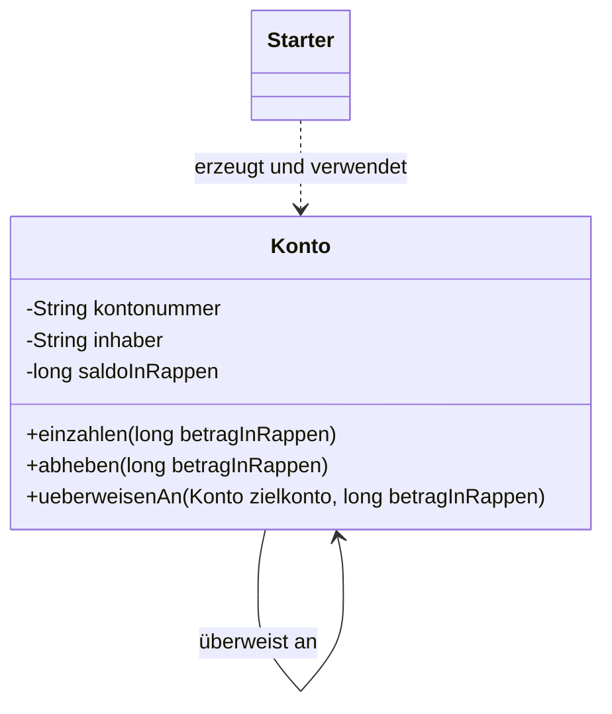
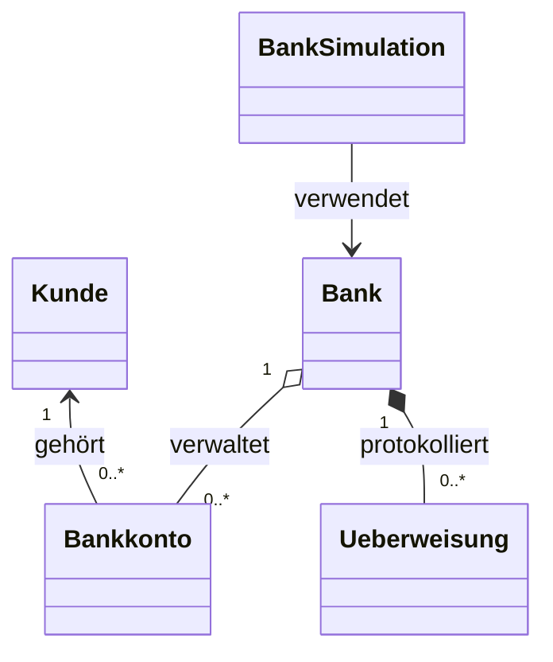

# KN-D1 – Banksimulation

| | |
|---|---|
| **Kompetenznachweis** | KN-D1 – Objektkommunikation und Datenkapselung |
| **Szenario** | Banksimulation |
| **Sprache** | Java |
| **Datum** | 17.08.2026 |

Original-Auftrag: <https://gitlab.com/ch-tbz-it/Stud/m320/-/tree/main/Kompetenzen/KN-D1>

## 1. Auftrag

Das Programm soll zeigen, wie eigene Klassen entworfen, Objekte erzeugt und
Methoden zwischen Objekten aufgerufen werden. Attribute dürfen nicht direkt von
aussen verändert werden. Einzahlen, Abheben und Überweisen verändern den
Zustand der beteiligten Konto-Objekte.

Der Auftrag verlangt zwei Implementationen. Deshalb enthält diese Abgabe zwei
Varianten der Banksimulation.

## 2. Implementation 1: direkte Kommunikation

Die einfache Variante besitzt zwei Klassen:

- `Konto` kapselt Kontonummer, Inhaber und Saldo.
- `Starter` erzeugt zwei Konten und führt Einzahlungen, Abhebungen und eine
  Überweisung aus.

Beim Aufruf `privatkonto.ueberweisenAn(sparkonto, 30_000)` erhält das
Quellkonto ein anderes `Konto`-Objekt und einen Betrag. Das Quellkonto ruft
anschliessend `zielkonto.einzahlen(...)` auf. Die beiden Objekte kommunizieren
also direkt miteinander.



### Ausführen

```powershell
cd src\KN-D1\implementation-1
javac -encoding UTF-8 -d out *.java
java -cp out kn.d1.impl1.Starter
java -cp out kn.d1.impl1.KontoTest
```

## 3. Implementation 2: Bank als Vermittler

Die erweiterte Variante trennt die Verantwortlichkeiten:

- `Kunde` speichert Kundennummer und Name.
- `Bankkonto` verwaltet einen gekapselten Saldo und gehört einem Kunden.
- `Bank` verwaltet mehrere Konten und stösst atomare Überweisungen an.
- `Ueberweisung` speichert einen unveränderlichen Eintrag im Verlauf.
- `BankSimulation` stellt ein interaktives Konsolenmenü bereit.

Der Benutzer kann Konten anzeigen, Geld einzahlen, Geld abheben, zwischen zwei
Konten überweisen und den Überweisungsverlauf anzeigen.



### Ausführen

```powershell
cd src\KN-D1\implementation-2
javac -encoding UTF-8 -d out *.java
java -cp out kn.d1.impl2.BankSimulation
java -cp out kn.d1.impl2.BankTest
```

Zu Beginn existieren diese Konten:

| Konto | Inhaber | Startsaldo |
|---|---|---:|
| `CH-2001` | Nico | CHF 1'500.00 |
| `CH-2002` | Lea | CHF 800.00 |

## 4. Fragen zur Besprechung

### Wie wird die Datenkapselung umgesetzt?

Alle Attribute sind `private`. Der Saldo kann nicht mit
`konto.saldoInRappen = ...` verändert werden. Eine Änderung ist nur über
kontrollierte Methoden wie `einzahlen`, `abheben` oder `ueberweisen` möglich.
Diese Methoden prüfen den Betrag und verhindern einen negativen Saldo.

`final` schützt ausserdem Werte wie Kontonummer und Inhaber davor, nach dem
Erzeugen des Objekts ausgetauscht zu werden. Listen werden als unveränderbare
Kopien oder Ansichten zurückgegeben.

### Wie kommunizieren die Objekte und welche Werte werden übergeben?

In Implementation 1 ruft ein Konto eine Methode des Zielkontos auf:

```java
zielkonto.einzahlen(betragInRappen);
```

Dabei werden das komplexe Objekt `zielkonto` und der primitive Wert
`betragInRappen` an die Methode `ueberweisenAn` übergeben.

In Implementation 2 kommuniziert `BankSimulation` mit `Bank`. Die Bank sucht
die beiden `Bankkonto`-Objekte und stösst über `ueberweisenAn(...)` die
Überweisung an. Das Quellkonto prüft beide neuen Salden, bevor es eines der
Objekte verändert. Dadurch bleibt der Vorgang auch bei einem Zahlenüberlauf
atomar.

### Wie verändert sich der Zustand eines Objekts?

Der Saldo ist der veränderbare Zustand eines Kontos. Eine Einzahlung erhöht
ihn, eine Abhebung reduziert ihn. Eine Überweisung verändert zwei Objekte:
Der Saldo des Quellkontos sinkt und der Saldo des Zielkontos steigt.

Vor einer Änderung werden alle Bedingungen geprüft. Bei einer ungültigen
Operation wird eine Exception ausgelöst und der Saldo bleibt unverändert.

### Was ist der Unterschied zwischen primitiven und komplexen Datentypen?

Primitive Datentypen speichern direkt einen einfachen Wert. Beispiele aus dem
Code sind `long saldoInRappen`, `int kundennummer` und `boolean laeuft`.

Komplexe Datentypen sind Objekte mit Attributen und Methoden. Beispiele sind
`String`, `Kunde`, `Bankkonto`, `Bank`, `List<Bankkonto>` und
`LocalDateTime`. Eine Variable eines komplexen Typs enthält eine Referenz auf
das Objekt.

## 5. Wesentliche Sicherheitsregeln

- Beträge müssen grösser als null sein.
- Ein Konto darf nicht überzogen werden.
- Quell- und Zielkonto müssen verschieden sein.
- Kontonummern müssen innerhalb einer Bank eindeutig sein.
- Geld wird intern als ganze Rappen (`long`) gespeichert; dadurch entstehen
  keine Rundungsfehler durch `double`.
- Ungültige Benutzereingaben und Zahlenüberläufe werden abgefangen; eine
  fehlgeschlagene Operation verändert keinen Saldo.

## 6. Dateien

```text
KN-D1/
├── README.md
├── implementation-1/
│   ├── Konto.java
│   ├── KontoTest.java
│   └── Starter.java
└── implementation-2/
    ├── Bank.java
    ├── Bankkonto.java
    ├── BankSimulation.java
    ├── BankTest.java
    ├── Kunde.java
    └── Ueberweisung.java
```

## 7. Lernziele-Check

- [x] Eigene Klassen entworfen und Objekte instanziiert
- [x] Methodenaufrufe zwischen Objekten gezeigt
- [x] Primitive Werte und komplexe Objekte übergeben
- [x] Attribute durch `private` vor direkter Veränderung geschützt
- [x] Zustandsänderungen durch Einzahlen, Abheben und Überweisen gezeigt
- [x] Zwei unterschiedliche Implementationen erstellt
