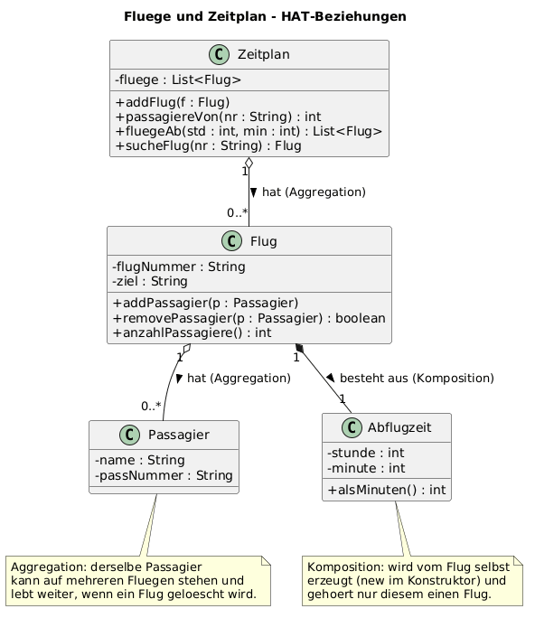

# KN-D2 – HAT-Beziehungen: Aggregation, Komposition, Delegation

Nico Schult (ZH-NICO) · Java · 24.08.2026
Auftrag: <https://gitlab.com/ch-tbz-it/Stud/m320/-/tree/main/Kompetenzen/KN-D2>

Gewählte Idee: **Flüge und Zeitplan.** Ein Flug hat Passagiere, ein Zeitplan
verwaltet mehrere Flüge. Damit lassen sich beide HAT-Arten direkt vergleichen.

---

## 1. Kurz gesagt

Es gibt zwei Arten von "HAT":

| | **Aggregation** (lose) | **Komposition** (stark) |
|---|---|---|
| Bild | Teil lebt allein weiter | Teil stirbt mit dem Ganzen |
| Wer erzeugt den Teil? | kommt von **aussen** rein | das Ganze erzeugt ihn **selbst** (`new`) |
| UML-Raute | **hohl** ◇ | **voll** ◆ |
| Beispiel hier | `Flug` hat `Passagier` · `Zeitplan` hat `Flug` | `Flug` besteht aus `Abflugzeit` |

**Delegation** = ein Objekt beantwortet eine Frage nicht selbst, sondern reicht
sie an ein anderes weiter.

---

## 2. Klassendiagramm



Quelle: [`diagramm/klassendiagramm.puml`](diagramm/klassendiagramm.puml) · [SVG](diagramm/klassendiagramm.svg)

Merksatz: **hohle Raute = Aggregation, volle Raute = Komposition.**

---

## 3. Die Klassen

| Klasse | Aufgabe |
|---|---|
| `Passagier` | Name + Passnummer. Eigenständig, kann auf mehreren Flügen sein. |
| `Abflugzeit` | Kleines Wert-Objekt (Stunde:Minute). Gehört nur einem Flug. |
| `Flug` | Flugnummer, Ziel; hält die Passagierliste **und** seine Abflugzeit. |
| `Zeitplan` | Verwaltet mehrere Flüge, sucht und zählt. |

---

## 4. Wo steckt was im Code?

### Aggregation (hohle Raute) – `Flug` hat `Passagier`
Die Passagiere kommen von **aussen** rein und leben unabhängig weiter:
```java
public void addPassagier(Passagier passagier) {
    passagiere.add(passagier);          // Objekt kommt von aussen
}
public boolean removePassagier(Passagier passagier) {
    return passagiere.remove(passagier); // nur aus der Liste, Objekt bleibt am Leben
}
```
Ebenso `Zeitplan` ↔ `Flug`: `zeitplan.addFlug(flug)` – der Flug existiert auch ohne Zeitplan.

### Komposition (volle Raute) – `Flug` besteht aus `Abflugzeit`
Der Flug **erzeugt** die Abflugzeit selbst und gibt sie nie heraus:
```java
public Flug(String flugNummer, String ziel, int stunde, int minute) {
    this.abflugzeit = new Abflugzeit(stunde, minute); // hier entsteht der Teil
}
```
Wird der Flug weggeworfen, ist auch die Abflugzeit weg → starke Abhängigkeit.

### Delegation – `Zeitplan` → `Flug` → `List`
`Zeitplan` zählt nicht selbst, sondern fragt den Flug; der Flug fragt seine Liste:
```java
// Zeitplan
public int passagiereVon(String flugNummer) {
    Flug flug = sucheFlug(flugNummer);
    return flug == null ? 0 : flug.anzahlPassagiere(); // weiterreichen
}
// Flug
public int anzahlPassagiere() {
    return passagiere.size();                          // weiterreichen
}
```

---

## 5. Ausführen

```bash
cd src/KR/KN_D2/code
javac -encoding UTF-8 -d out *.java
java -cp out kn.d2.Starter        # Demo
java -cp out kn.d2.ZeitplanTest   # Tests
```

Demo-Ausgabe (gekürzt):
```text
Alle Fluege:
  LX14 -> London um 08:30 (2 Passagiere)
  LX88 -> New York um 13:05 (1 Passagiere)
Passagiere auf LX14: 2
Nach Entfernen von Ben -> LX14 hat 1 Passagiere
Ben lebt weiter (Aggregation): Ben Muster (P456)
```

`ZeitplanTest` prüft: Aggregation (Passagier lebt nach `remove` weiter),
Delegation (`passagiereVon`), Zeit-Suche und Entfernen. → *"Alle Tests erfolgreich."*

---

## 6. Antworten auf die Gesprächsfragen

**Welche HAT-Beziehungen verwende ich im Code?**
- **Aggregation:** `Flug` hat `Passagier`e und `Zeitplan` hat `Flug`e. Beide werden
  von aussen hinzugefügt (`addPassagier`, `addFlug`) und leben unabhängig weiter.
- **Komposition:** `Flug` besteht aus einer `Abflugzeit`, die er im Konstruktor
  selbst mit `new` erzeugt und nie herausgibt.

**Welche HAT-Beziehung wann? Mögliche Szenarien.**
- **Aggregation**, wenn der Teil auch **ohne** das Ganze Sinn macht oder von mehreren
  geteilt wird. Beispiel: Ein Passagier bleibt bestehen, auch wenn ein Flug gestrichen
  wird, und kann gleichzeitig auf mehreren Flügen gebucht sein.
- **Komposition**, wenn der Teil **nur** als Bestandteil des Ganzen existiert und mit
  ihm entsteht und vergeht. Beispiel: Die Abflugzeit gehört genau zu diesem einen Flug –
  ohne den Flug ist sie sinnlos. Weitere typische Fälle: ein Haus und seine Räume,
  eine Rechnung und ihre Rechnungszeilen.

---

## 7. Dateien

```text
KN_D2/
├── README.md
├── code/
│   ├── Passagier.java      <- eigenständig (Aggregations-Teil)
│   ├── Abflugzeit.java     <- gehört zum Flug (Kompositions-Teil)
│   ├── Flug.java           <- zeigt Aggregation UND Komposition
│   ├── Zeitplan.java       <- verwaltet Flüge, delegiert
│   ├── Starter.java        <- Demo
│   └── ZeitplanTest.java   <- Tests (ohne externe Library)
└── diagramm/
    └── klassendiagramm.puml / .png / .svg
```
